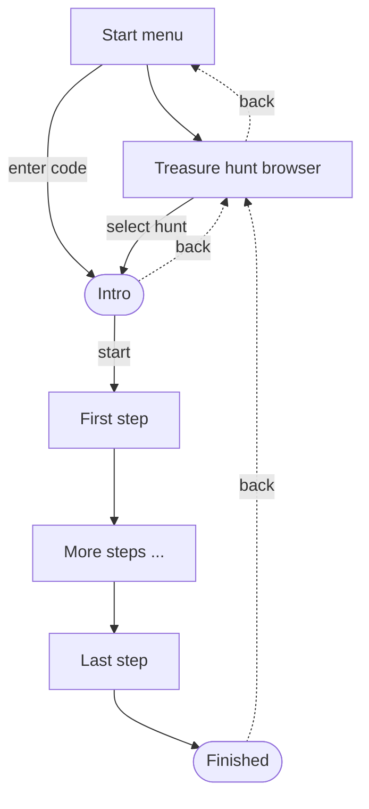

# Treasure Hunt

## Planning

### Technologies

- Svelte
- SvelteKit
- PostgreSQL

### Features

- available treasure hunts
- load/unlock hunt via code
- QR Code Reader
- share treasure hunts

### Dialogs

- Start menu
- Treasure Hunt Browser
- Treasure Hunt
  - Intro
  - Steps (one or more)
  - Finished

### modals

- QR code scanner
- Step menu

## ideas

- generate a hunt from a JSON file
- store Markdown step text in separate files or inside the JSON file
