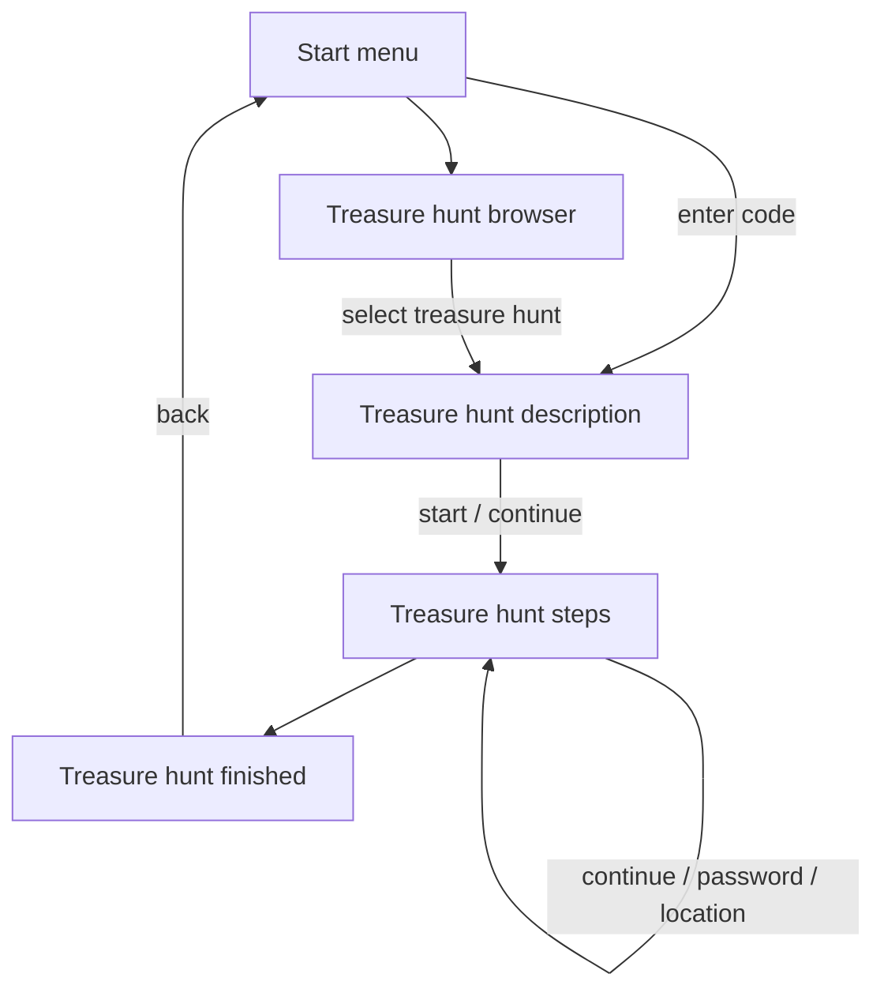

# Treasure Hunt

## Project Planning

### Technology Stack

- Svelte
- SvelteKit
- PostgreSQL

### Core Features

- Available treasure hunts
- Load or unlock a hunt via code
- QR code reader
- Share treasure hunts

### Dialogs

- **Start Menu**
- **Treasure Hunt Browser**
- **Treasure Hunt**
  - Description
  - Steps
  - Finished

#### Navigation Flow

### Modals

- QR code scanner
- Step menu

## Ideas

- Generate a hunt from a JSON file
- Store Markdown step text in separate files or inside the JSON file
- Step solutions
  - continue
  - password
  - location
